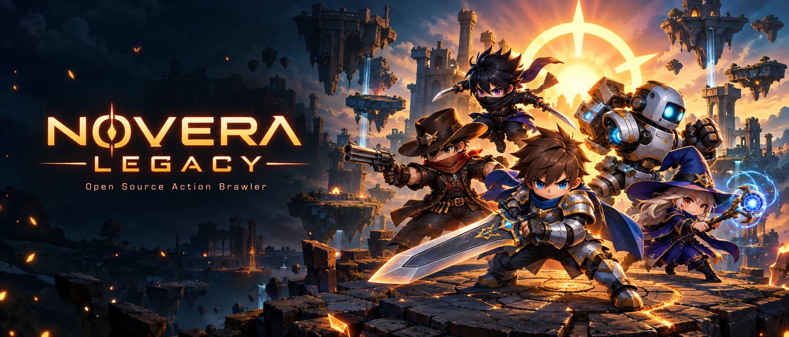

# NOVERA Legacy

<p align="center">
  
</p>

**Copyright NOVERA OSS.** The revived source tree of the classic Korean
action-brawler *Lost Saga* — game client, server suite, launcher, and
tooling — now building with Visual Studio 2022 (C++17).

> ⚠️ **Disclaimer** — This project is released for **educational and
> game-preservation purposes only**. It is not affiliated with, endorsed by,
> or connected to the original developers or publishers of Lost Saga. No
> game client binaries, assets, or copyrighted media are included in this
> repository. You must provide your own game client and resource files.

---

## Project direction

NOVERA Legacy is the open, self-hostable continuation of Lost Saga. There is
no official server to join and none is planned — the tree ships complete
source, databases, and runtime configuration so anyone can run the game on
their own machine. The project preserves the game and improves it:
incremental, real changes, not a replica of any specific Korean season.
Contributions are welcome — see [CONTRIBUTING.md](CONTRIBUTING.md).

## What's inside

Nearly the entire game lives in this tree: client, engine, servers,
launcher, patcher, monitoring, and the tools used to build and operate it.

```
├── src/
│   ├── NoveraClient/            the game client (3,600+ files: gameplay,
│   │                             characters, skills, items, UI, networking)
│   ├── io3DEngine/              3D rendering and scene engine
│   ├── ioPac/                   .iop resource package reader/writer
│   ├── ioFreeType/               font rendering
│   ├── OggVorbis/                audio decoding
│   ├── FlashPlayerToDirectX/     Flash-in-DirectX layer (UI movies)
│   ├── ioWinHttp/               HTTP
│   ├── ErrorDlg/                 error dialogs
│   ├── TownPortal/              client support components
│   │
│   ├── ls_gamesvr/              game server (login, lobby, rooms, modes,
│   │                             shop, guild UI)
│   ├── ls_mainsvr/              coordinator (guilds, trade market,
│   │                             tournaments, matchmaking)
│   ├── ls_billingsvr/           billing relay (cash queries, regional
│   │                             payment partners)
│   ├── ls_dbagent/              async DB proxy — ADO + stored procedures
│   │                             (run one per database: game + log)
│   ├── ls_filewritesvr/         player skin upload server
│   ├── ls_loginsvr/             optional — patcher load balancer
│   ├── ls_relaysvr/             optional — dedicated UDP relay
│   │
│   ├── iocpSocketDLL/           IOCP network core
│   ├── ioINILoader/             INI config loading
│   ├── Log/                     logging
│   ├── FrameTimerDLL/           frame timing
│   │
│   ├── LSPacketSniffer/         Npcap-based packet analyzer for the
│   │                             Lost Saga wire protocol
│   ├── LSMonitor/               monitoring
│   ├── LSController/            control
│   ├── LSLog/                   log tooling
│   ├── LSLogClient/             log client
│   ├── PerfMon/                 performance monitor
│   │
│   ├── LSAutoUpgrade/           launcher/upgrader
│   ├── PatchManager/            patch manager
│   ├── LSWebBroker/             web broker
│   │
│   ├── VCSGen/                  version-stamp generator
│   ├── gperftools-2.1/          profiler
│   └── ziparchive320/           zip archive support
│
├── data/                        sanitized runtime configuration —
│                                 server and client templates
│                                 ([guide](docs/CONFIG.md))
├── docs/                        [Building](docs/BUILDING.md),
│                                 [database setup](docs/DATABASE.md),
│                                 [configuration](docs/CONFIG.md),
│                                 [release process](docs/release.md),
│                                 [SMO export](docs/SMO-DB-EXPORT.md),
│                                 [localization](docs/LOCALIZATION.md)
├── extra/                       developer utilities (opcode-to-string
│                                 parser, encoder, CRC/INI checkers,
│                                 billing lists, static libs)
├── lib/                         prebuilt binaries (DXSDK, lib_Shipping)
├── scripts/                     build & localization tooling
│                                 (string converters, encoding fixers)
├── sql/                         SQL Server schemas — LosaGame,
│                                 LosaGame_log, LosaLogData
│                                 (ANSI + UNICODE variants)
├── Tools/                       prebuilt developer tools
│                                 (LSPacketSniffer, LSController, VCSGen)
└── win/                         Visual Studio 2022 solutions and
                                  project files
```

## Running it yourself

There is no official server and no prebuilt binary distribution — the tree
is meant to be built and run on your own machine:

1. **Build** the client and server suite — see [docs/BUILDING.md](docs/BUILDING.md).
2. **Restore the databases** — see [docs/DATABASE.md](docs/DATABASE.md).
3. **Deploy the runtime configuration** from `data/` — see
   [docs/CONFIG.md](docs/CONFIG.md).
4. **Start the servers** in dependency order: dbagent → billingsvr →
   mainsvr → gamesvr → filewritesvr.

Releases on the mirrors carry automatically generated notes; the source at
each tag is the complete package.

## License

Copyright NOVERA OSS. Licensed under the **GNU General Public License v3** —
see [LICENSE](LICENSE) for details.

This project is not affiliated with the original developers or publishers
of Lost Saga and is intended for educational and preservation purposes.
